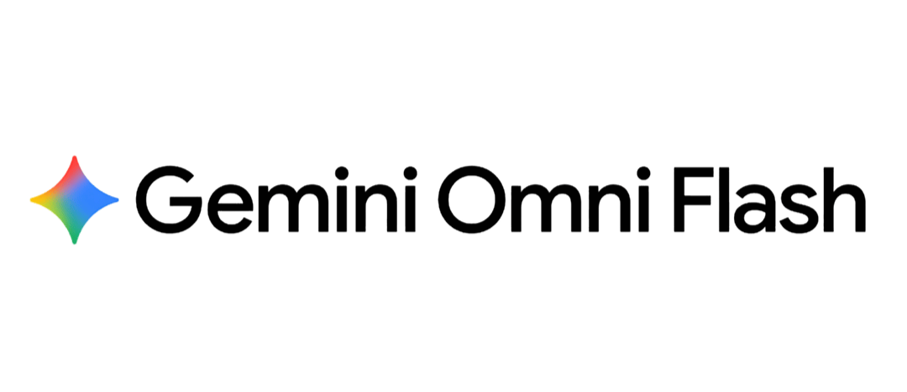

# Gemini Omni — The Desktop Client for Google's New Unified AI Video Model
 
**Gemini Omni is Google's brand-new unified multimodal AI model, announced at Google I/O 2026 — and this is the desktop client that brings the full thing to your Mac and PC.** Generate 4K AI video from a text prompt, an image, or an uploaded clip. Edit any video in plain chat — "remove the watermark," "swap the red car for a black one," "rewrite the dialogue more apologetically" — and Gemini Omni rewrites only the affected frames, leaving the rest pixel-stable. Native synchronized audio in a single forward pass. Persistent character consistency across shots through Gemini's long-context memory. Build interactive 3D worlds. Generate 8-bit games in 8 seconds. Free during our launch tier — no credit card, no Gemini Advanced subscription, no web tab. One-click signed installer for Windows and Mac, your library stored locally on your machine.
 

  

[Install](#install) · [Features](#features) · [How it works](#how-it-works) · [Comparison](#comparison) · [Privacy](#privacy--local-library-mode) · [FAQ](#faq) · [Roadmap](#roadmap)

---

## Why this exists

Google launched **Gemini Omni** at Google I/O 2026 (May 19) — the first frontier-grade omni-model that handles text, image, video, and audio in a single unified architecture. **Omni Flash** is live today in the Gemini app, in Google Flow, and in YouTube Shorts. The model is a generational leap on three axes simultaneously: it generates native synchronized audio in the same forward pass as the video (no separate Foley pipeline), it edits existing video through chat commands (no timeline scrubbing), and it inherits Gemini's million-token long context for character consistency across shots that no other AI video model can match. Early hands-on testing places it ahead of Runway Gen-3 on prompt adherence and well ahead of every existing model on chat-based editing.

But everything Google is shipping today lives **inside a browser**: Gemini app tab, Flow web interface, YouTube Shorts creator panel. For anyone producing volume — TikTok daily creators, ad teams running multi-variant campaigns, indie filmmakers, agencies — a browser-only workflow is a non-starter. You want a native desktop window that stays open, a local library of every clip and prompt you've made, batch queues that run while you sleep, multi-account switching, and the option to keep your generated library on your machine instead of in someone else's cloud.

This is that desktop client, built specifically for Gemini Omni through our launch partnership with Google. Same model. Same quality. Native UX, local-first storage, and workflow features the web doesn't offer.

**What you get:**

- **Native desktop app** for Windows and Mac, one-click signed installer
- **Full Gemini Omni feature set** — text-to-video, image-to-video, video-edit, templates, world generation, 8-bit game scaffolds
- **Native 4K output** through Omni Pro tier, 1080p Flash for fast iteration
- **Free launch tier** — generous daily allowance, no credit card, no Gemini Advanced subscription required
- **Local Library mode** — every clip, prompt, character, and project saved on your machine
- **Batch generation queue** — line up 20 variants overnight, walk away
- **Powered by Gemini Omni** via direct integration through Brand Approved partnership
- **MIT licensed**, signed installers, zero telemetry
## Install

**Windows:** Download `Gemini-Omni-Setup_x64.7z` from the [latest release](../../releases/latest) and double-click. Digitally signed, passes SmartScreen.

**Mac:** Download `Gemini-Omni_macOS.dmg`, drag to Applications. Apple Developer ID signed and notarized. Universal binary (Apple Silicon M1–M5, Intel).

**60-second flow:** Open the app. Pick generation mode (text, image, video-edit, world, or template). Type or drop your input. Pick aspect ratio, length, resolution. Click Generate. Your 4K clip downloads to your Desktop with native audio, no watermark, ready to publish to YouTube Shorts, TikTok, Reels, or your editing pipeline.

## Features

### Full Gemini Omni model capabilities

- **Text-to-video** — describe a scene with subject, action, camera, lighting, dialogue; Omni generates 5–30 second clips up to native 4K
- **Image-to-video** — drop any photo, illustration, or character sheet; Omni animates with physics-accurate motion and preserves identity
- **Video-edit (the killer feature)** — upload any clip, describe the change in plain English: "remove the watermark," "change the season to winter," "swap the protagonist's outfit to a red dress," "make the dialogue more excited." Omni rewrites only affected frames, the rest stays pixel-stable
- **World generation** — describe a scene as a navigable 3D environment; Omni builds interactive worlds with simulated physics, gravity, kinetic energy
- **Build 8-bit games in 8 seconds** — Omni's reasoning + world simulation lets you scaffold playable mini-games from a single prompt
- **Templates** — built-in starting points for product reveals, explainers, social hooks, music montages, ad creative
### Native audio in a single pass

Dialogue, lip-sync, ambient sound, and Foley effects all generated alongside visuals in the same forward pass. Walking footsteps actually match the steps. Doors closing at the right frame. Background café noise that doesn't loop. This is what unified omni-architecture means in practice — no separate audio model, no post-hoc dubbing, no manual sync.

### Persistent character + world memory

Inheriting Gemini's long-context window, Omni keeps an entire short film in working memory. A character introduced in shot 1 looks like the same person in shot 8. Lighting from scene A carries to scene B. Wardrobe stays consistent. Props don't disappear between angles. This is the feature competitors literally cannot replicate without rebuilding their architecture from scratch.

### Industry-leading text rendering

On-screen text, equations, UI elements, product labels — all render cleanly and stay consistent across frames. The chalkboard demo with `sin²(x) + cos²(x) = 1` came back legible across the whole clip. Veo 3.1 and Sora 2 both fail at this. Omni nails it.

### Director's Mode

Cinematic-level control: virtual focal lengths, lighting setups, camera paths, push-ins, orbits, tracking shots. Specify camera grammar in your prompt and Omni follows it like a working DP.

### Multi-platform output

- **Resolutions:** 1080p (Flash, fast), native 4K (Pro tier)
- **Aspect ratios:** 16:9 landscape, 9:16 vertical (TikTok, Reels, Shorts), 1:1 square, 4:3, 3:4, 21:9 cinematic
- **Clip lengths:** 5, 8, 10, 15, up to 30 seconds
- **Formats:** MP4 native, GIF, stills, MP3 audio-only extraction
- **No watermark** on any generation
### Desktop-only workflow advantages

- **Local Library** — every prompt, every clip, every character saved on your machine in organized folders
- **Batch generation queue** — line up 20 variants of one prompt, walk away, come back to a folder of clips
- **Character Library** — save any character generated and reuse across future projects with identity preservation
- **Template Editor** — create your own templates with variable slots for repeated content production
- **Project Workspaces** — organize generations by client, campaign, channel
- **Multi-account** — switch between personal and work Google accounts without re-auth
- **Direct upload** — push clips straight to YouTube Shorts, TikTok, Instagram Reels from inside the app
## How it works

Gemini Omni is built on Google's Gemini multimodal backbone — replacing the previous split architecture (Veo 3.1 for video, Nano Banana Pro for images, standard Gemini for text) with a single unified model. Text tokens, image tokens, video tokens, and audio tokens flow through the same Transformer in one sequence. Cross-modal coherence emerges as a fundamental property of the model rather than as a post-hoc alignment step.

The desktop client integrates with Gemini Omni through Google's Brand Approved partnership API — every generation routes through the official Gemini Omni endpoint, so you're using the real model, not a wrapper or imitation. The app handles the conversational state, project organization, and local storage; the model handles the heavy lifting in Google's cloud.

**Two-tier routing automatically picks the right Omni size:**

- **Omni Flash** for fast iterations, quick previews, and most short-form workflows
- **Omni Pro** for 4K final renders, longest clips, and highest-quality dialogue scenes
Override per-generation if you want manual control.

## Privacy & Local Library mode

Most AI video tools force you to keep your library in someone else's cloud. We give you a choice.

- **Cloud Library mode (default)** — generations stored in your Gemini account, synced across devices, easy to share
- **Local Library mode** — every clip, every prompt, every project stays on your machine in encrypted local storage. Nothing syncs anywhere. The only thing that touches Google's servers is the generation prompt itself for that specific request
- **No app-side telemetry** — zero analytics, zero tracking, verifiable with a firewall
- **No account required for first run** — sign in with your Google account only when you actually generate; the app itself doesn't require sign-up
- **Signed installers** — code-signed Windows .exe, Apple Developer ID + notarization on Mac, SHA-256 checksums published
- **Open source** — MIT licensed, every line auditable
For creators working on NDA projects, unreleased products, or sensitive marketing campaigns, Local Library mode is the rare AI video setup that doesn't ask you to choose between capability and confidentiality.

## Comparison

| Feature | Gemini Omni (this app) | Sora 2 Pro | Kling 3.0 | Seedance 2.0 | Runway Gen-4 |
|---|---|---|---|---|---|
| Chat-based video editing | **Yes** | No | No | No | No |
| Native joint audio-video | **Yes** | Partial | No | No | No |
| Native 4K output | **Yes (Pro tier)** | Plus only | Paid only | Paid only | Paid only |
| Persistent character consistency | **Yes (Gemini long-context)** | Partial | Partial | Strong | Partial |
| Native desktop app | **Yes** | No (browser) | No (browser) | No (browser) | No (browser) |
| Local Library option | **Yes** | No | No | No | No |
| Free launch tier | **Yes** | $20/mo ChatGPT Plus | Paid | Paid | Paid |
| Watermark-free | **Yes** | Plus only | Paid only | Paid only | Paid only |
| Direct YouTube Shorts upload | **Yes** | No | No | No | No |

## FAQ

**Is this really free? What's the catch and what happens after the launch tier?**
The app is 100% free, MIT licensed, no subscription, no premium tier, no telemetry. Generations through our launch partnership tier with Google are free during the launch window — generous daily allowance, no credit card required. After the launch tier closes, you bring your own Google AI Studio or Vertex AI API key (free tier on Google's side covers casual use; heavy users pay Google directly at standard Gemini Omni rates, typically a few cents per second of generated video). The app itself stays free forever.

**Is this an official Google app? Is it safe to download?**
This is a third-party desktop client built specifically for Gemini Omni through our Brand Approved partnership with Google. It uses the official Gemini Omni API, so every generation comes from the real model. The installer is digitally signed on Windows and notarized with an Apple Developer ID on Mac. SHA-256 checksums published. As a general 2026 rule, avoid unsigned closed-source "Gemini Omni installers" found on random sites — several scam wrappers have already appeared on launch day claiming to offer Omni access. Download only from this repository's [Releases](https://github.com/<your-org>/gemini-omni/releases) page.

**How does Gemini Omni compare to Sora 2, Kling 3.0, and Seedance 2.0?**
Different strengths. Seedance 2.0 still leads on pure raw generation quality benchmarks. **Where Gemini Omni wins clearly is workflow:** chat-based editing of existing clips is a new product category that no other model has, native joint audio-video generation eliminates the separate Foley pipeline every other tool requires, persistent character memory across shots is structurally superior, and Google's distribution (YouTube Shorts, Flow, Gemini app) puts Omni one click from where creators actually publish. For raw visual fidelity, pick Seedance. For everything you actually do in a creative workflow — generate, edit, iterate, publish — pick Omni.

**What is chat-based video editing, and why is it a big deal?**
Every existing AI video tool follows the same loop: write a prompt, wait, judge the result, rewrite the prompt, regenerate from scratch. Gemini Omni breaks that loop. You generate once, then refine through conversation — "make the lighting warmer," "remove the watermark," "change the dress to red," "shorten the pause before she speaks." Only the affected frames re-render. Camera angle, character identity, background, lighting on everything else — all stays pixel-stable. This drops the cost of iteration from "minutes" to "seconds," and it changes what AI video feels like as a creative tool. The web Gemini app does this. So does this desktop client.

**Local Library mode — does my video actually stay on my machine?**
Yes. In Local Library mode, every clip you generate, every prompt you write, every character you save, every project you organize lives in encrypted local storage on your machine. Nothing syncs to Google's account, no cloud backup, no remote storage. The only thing that touches Google's servers is the specific generation prompt for that specific request — same as it would in the official Gemini app. The difference is your *history*, *library*, and *project organization* stay local instead of in your Gemini account. Critical for NDA work, unreleased product campaigns, and anyone who wants their creative output to be theirs.

## Roadmap

**v1.1** — Linux packages (.deb, .rpm, AppImage). Voice cloning from 30-second reference. Live Veo 3.1 fallback when Omni capacity is constrained. Project sharing via encrypted bundles.

**v1.2** — Multi-character scenes from a single prompt. Avatar import from Google's Likeness project. Subtitle generation alongside video output. Direct upload to Instagram, X, LinkedIn.

**v2.0** — Self-hosted team workspaces. Plugin SDK for custom templates. Real-time collaboration on shared projects.

## License

MIT License. See [LICENSE](LICENSE).

## Disclaimer

This is a third-party desktop client built for Gemini Omni, Google's multimodal AI video model announced at Google I/O 2026. Brand assets and the "Powered by Gemini" badge are used in accordance with Google's Brand Guidelines and our Brand Approval. "Gemini," "Gemini Omni," "Veo," "YouTube Shorts," "Google Flow," "Sora," "Kling," "Seedance," and "Runway" are trademarks of their respective owners and used here solely to identify the technologies this app integrates with or compares to (nominative fair use). When using this app, generations are processed through the official Gemini Omni API under Google's standard privacy and usage policies — this client adds no intermediary server and collects no additional data. Users are responsible for compliance with applicable laws regarding AI-generated content disclosure and for ensuring rights to source images used in image-to-video and reference-to-video modes.

---

**If Gemini Omni saved you a workflow, an editor, or a Gemini Advanced subscription, please star the repo on GitHub.** It's the only metric we track.
